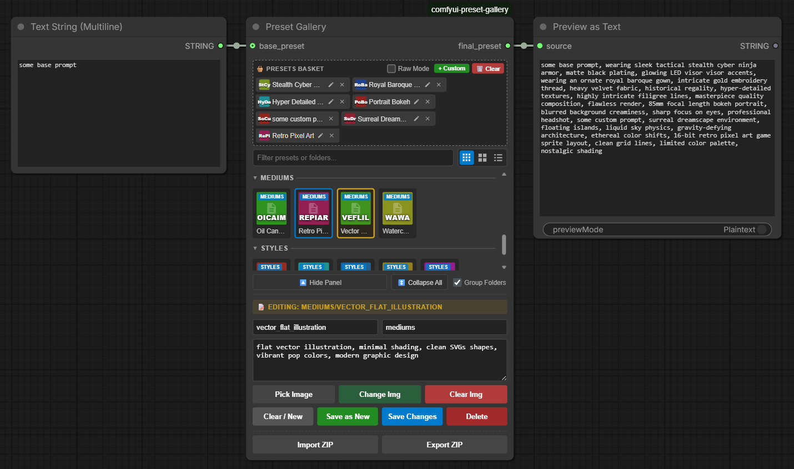

# ComfyUI Preset Gallery
A sleek, visual extension for ComfyUI to save, organize, filter, and reuse your favorite prompt snippets and style templates using an interactive embedded grid.



## 🚀 Quick Start

### 1. Installation

Navigate to your ComfyUI custom nodes directory and clone the repository:

```bash
cd ComfyUI/custom_nodes
git clone https://github.com/j0n4t/comfyui-preset-gallery.git
```

> Sample presets: [presets_sample.yml](./presets_sample.yml)

Restart ComfyUI to load the extension.

### 2. Basic Workflow

1. **Add Node:** Right-click the canvas and select **Add Node → utils › Preset Gallery**.
2. **Connect Output:** Link `final_preset` to a text encoder (e.g., *CLIP Text Encode*). Prepend text by wiring into the optional `base_preset` slot.
3. **Select Items:** Click any grid thumbnail to add it to the **Basket**. Click multiple items to concatenate them into a single prompt sequence.
4. **Queue Prompt:** Run your generation; the combined string is sent right down the pipeline.

## Key Features

### 🧺 Interactive Presets Basket

* **Drag-and-Drop:** Drag presets directly from the grid to arrange, sort, or insert them exactly where you want them inside your basket.
* **Raw Mode & Auto-complete:** Toggle **Raw Mode** to edit your selection as raw comma-separated text. Includes an overlay auto-complete helper with fuzzy search matching and syntax highlighting for better readability.
* **Custom Snippets:** You can add one-time keywords into your selection pool without cluttering your library.

### 🔍 Live Grid Layouts & Filter Search

* **Dynamic Views:** Toggle between small grids, large visual grids, or clean list views instantly.
* **Live Search & Grouping:** Filter presets instantly by keyword, path, or tag. Keep things organized with subfolder groups.

### ⚙️ Management & Preset Editor

Expand the **⚙️ Management Panel** to curate your collection:

* **Save, Edit, Overwrite:** Create brand‑new items or edit existing items on your grid to update text parameters or subfolders.
* **Image Assets:** Add, replace, or erase reference cover artwork (`.jpg`, `.png`, `.webp`) for any preset entry.
* **Persistence:** Your preset pool is saved in browser `localStorage`, and you can import and export via `.yaml`, `.json` or `.zip` files.